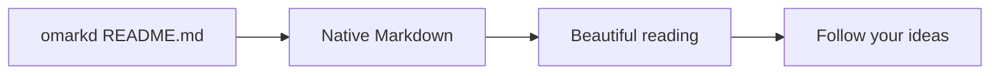

# From terminal to reader

Mermaid diagrams are loaded only when a document needs them.

```mermaid
flowchart LR
    A["omarkd README.md"] --> B["Native Markdown"]
    B --> C["Beautiful reading"]
    C --> D["Follow your ideas"]
```

## Works offline

The parser, highlighting, equations, and diagrams run locally.
